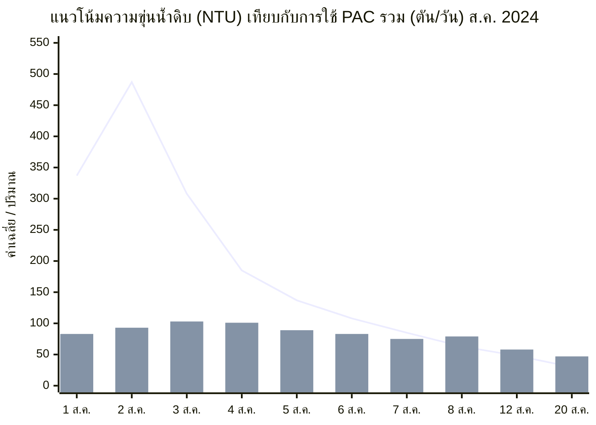
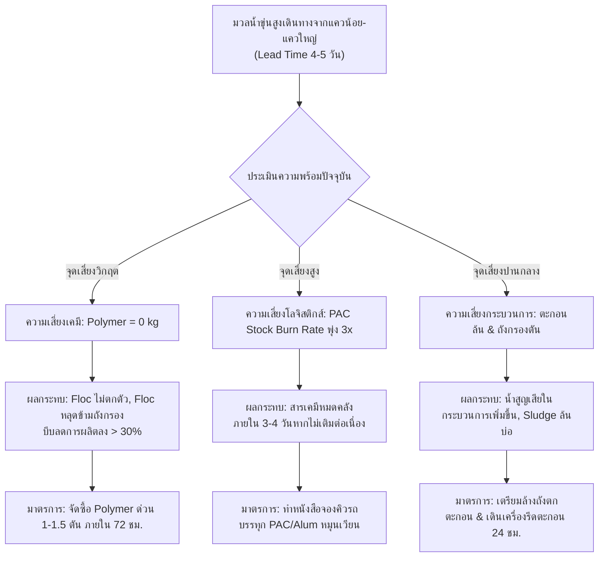

# รายงานสรุปเชิงเปรียบเทียบและการประเมินความเสี่ยงเพื่อเตรียมรับมือสถานการณ์น้ำดิบขุ่นสูง (> 500 NTU)
**โรงงานผลิตน้ำมหาสวัสดิ์ (MS) การประปานครหลวง**
*อ้างอิงข้อมูลสถิติการผลิตและคุณภาพน้ำจริงเดือนสิงหาคม 2024 | จัดทำสำหรับการประเมินสถานการณ์ปี 2026*

---

## 1. บทสรุปผู้บริหารและประเด็นวิกฤตเร่งด่วน (Executive Summary & Critical Alerts)

ตามที่ได้รับรายงานการแจ้งเตือนจากลุ่มน้ำแม่กลองตอนบน (แม่น้ำแควใหญ่และแควน้อย) ว่าตรวจพบมวลน้ำที่มีความขุ่นสูงในระดับใกล้เคียงกับปี 2024 และมวลน้ำกำลังเดินทางเข้าสู่คลองประปาฝั่งตะวันตกโดยมีระยะเวลาเดินทาง (Lead Time) ประมาณ **4–5 วัน** ก่อนถึงสถานีสูบน้ำดิบมหาสวัสดิ์ (QWS)

จากการวิเคราะห์ข้อมูลเชิงลึกของการผลิตน้ำประปาและปริมาณการใช้สารเคมีในช่วงวิกฤต 1–10 สิงหาคม 2024 เปรียบเทียบกับสภาวะปัจจุบัน พบประเด็นความเสี่ยงสูงสุดและข้อเสนอแนะเชิงนโยบายดังนี้:

> [!CAUTION]
> ### ประเด็นวิกฤตระดับสูงสุด (Code Red): สต็อกสารพอลิเมอร์ (Polymer) เป็นศูนย์ (0 kg)
> * **บทเรียนจากปี 2024:** ในช่วงความขุ่นพุ่งสูงเกิน 200–500 NTU โรงงาน**จำเป็นต้องจ่ายพอลิเมอร์ (Coagulant Aid) ทันทีตั้งแต่วันแรก** และจ่ายต่อเนื่อง 10 วัน รวมปริมาณการใช้ทั้งสิ้น **719 กก.** (พีคสูงสุด **125 กก./วัน**) เพื่อช่วยเร่งการรวมตะกอนและเพิ่ม Settling Velocity ในถังตกตะกอน
> * **ความเสี่ยงหากไม่มี Polymer:** หากมวลน้ำความขุ่น > 300–500 NTU มาถึงโดยไม่มี Polymer การจ่ายสารส้มหรือ PAC เพียงอย่างเดียวจะไม่สามารถทำให้ตะกอนตกตัวได้ทัน ตะกอนเบา (Pin-point flocs) จะหลุดลอยข้ามไปยังถังกรอง ส่งผลให้ถังกรองตันอย่างรวดเร็ว (Filter clogging ภายใน 1–2 ชม.) สูญเสียน้ำล้างกรองมหาศาล และบีบให้โรงงานต้องลดกำลังการผลิตลงมากกว่า 30–50% หรือเสี่ยงต่อการหลุดรอดของคุณภาพน้ำประปา
> * **ข้อสั่งการเร่งด่วน:** ต้องเปิด PO ฉุกเฉินจัดซื้อและขนส่ง Polymer ชนิดผง/น้ำ เข้าคลังโรงงานผลิตน้ำมหาสวัสดิ์อย่างน้อย **1,000–1,500 กิโลกรัม (1.0–1.5 ตัน)** ภายในระยะเวลา **72–96 ชั่วโมง (ก่อน T-Day)**

> [!WARNING]
> ### ประเด็นความเสี่ยงรอง: อัตราการเผาผลาญสารเคมี (Chemical Depletion Rate) พุ่งขึ้น 2.5–3.0 เท่า
> * สต็อก PAC และสารส้มที่ประเมินว่า "เพียงพอ 7–14 วัน" นั้น อ้างอิงจากอัตราการใช้ในสภาวะปกติ (~35 ตัน/วัน สำหรับ PAC)
> * แต่ในช่วงวิกฤตความขุ่น อัตราการใช้ PAC จะพุ่งขึ้นสู่ **83–103 ตัน/วัน** ทำให้สต็อก 7 วันตามปกติ จะลดลงเหลือรองรับได้เพียง **2.5–3 วัน** เท่านั้น จึงจำเป็นต้องสั่งการผู้ค้า (Suppliers) จัดคิวรถบรรทุกสารเคมีแบบหมุนเวียน (Continuous Logistics Standby) ล่วงหน้า

---

## 2. การเปรียบเทียบข้อมูลสถิติ: สภาวะปกติ vs เหตุการณ์วิกฤตปี 2024

จากการประมวลผลข้อมูลรายวัน (August 2024) พบความเปลี่ยนแปลงเชิงปริมาณในทุกมิติ ดังนี้:

### ตารางเปรียบเทียบตัวชี้วัดหลัก (Key Operational Metrics)

| ตัวชี้วัดการผลิตและสารเคมี | สภาวะปกติ (Normal Baseline) | ช่วงพีควิกฤต (Peak Surge 1–4 ส.ค. 2024) | อัตราความเปลี่ยนแปลง | ผลกระทบเชิงปฏิบัติการ |
|---|---|---|---|---|
| **ความขุ่นน้ำดิบ (Turbidity)** | 20 – 35 NTU | **สูงสุด 525 NTU** (เฉลี่ย 350–520 NTU) | **พุ่งสูงขึ้น 15 – 25 เท่า** | พุ่งจาก 111 สู่ 525 NTU ภายใน 20 ชม. |
| **ปริมาณสูบน้ำดิบ (Raw Water)** | ~1,580,000 – 1,600,000 ลบ.ม./วัน | **1,434,500 – 1,443,300 ลบ.ม./วัน** | **ลดลง ~150,000 ลบ.ม./วัน (-9.5%)** | ต้องลด Flow เพื่อเพิ่ม Retention Time |
| **ปริมาณผลิตน้ำประปา (Treated Water)** | ~1,500,000 – 1,540,000 ลบ.ม./วัน | **1,376,200 ลบ.ม./วัน** (ต่ำสุด 2 ส.ค.) | **ลดลง ~165,000 ลบ.ม./วัน (-11.2%)** | สูญเสียน้ำในระบบระบายตะกอนและล้างกรอง |
| **ปริมาณการใช้ PAC** | 33 – 40 ตัน/วัน | **103.4 ตัน/วัน** (สูงสุด 3 ส.ค.) | **เพิ่มขึ้น +180% (2.8 เท่า)** | Dosage พุ่งจาก 12 mg/L สู่ 32.3 mg/L |
| **ปริมาณการใช้สารส้ม (Alum)** | 10 – 18 ตัน/วัน | **36.4 ตัน/วัน** (สูงสุด 4 ส.ค.) | **เพิ่มขึ้น +140% ถึง +260%** | Phase 4 จ่ายสารส้มสูงถึง 47.3 mg/L |
| **ปริมาณการใช้ Polymer** | **0 กิโลกรัม/วัน** | **125 กิโลกรัม/วัน** (0.125 ตัน/วัน) | **Emergency Dosage** | จ่ายเฉลี่ย 0.05–0.10 mg/L ทั้ง 4 Phase |

*(เส้น = ความขุ่นน้ำดิบ NTU | แท่ง = ปริมาณการใช้ PAC ตัน/วัน)*

---

## 3. การประเมินความเสี่ยงและผลกระทบเชิงระบบ (Comprehensive Risk Assessment)

### 3.1 ความเสี่ยงด้านการตกตะกอนและการกรอง (Clarification & Filtration Risk)
* **พฤติกรรม Floc Carryover:** เมื่อน้ำมีความขุ่นสูงมาก ตะกอนสารส้ม/PAC ที่ไม่มี Polymer ช่วยเชื่อมพันธะจะมีขนาดเล็ก ละเอียด และจมตัวช้า การทำงานของถังตกตะกอนแบบ Pulsator / Superpulsator จะสูญเสีย Sludge Blanket เสี่ยงต่อการเกิดตะกอนหลุดข้าม Weirs
* **รอบการล้างถังกรอง (Filter Run Time):** ในปี 2024 ปริมาณน้ำสูบจ่ายลดลงมากกว่าน้ำดิบถึง ~15,000–25,000 ลบ.ม./วัน สะท้อนว่ามีการนำน้ำประปาไปใช้ในการ Backwash ถังกรองและระบาย Sludge ถี่ขึ้น หากไม่มีการคุมตะกอนล่วงหน้า ถังกรองจะตันเร็วขึ้นเป็นเท่าตัว

### 3.2 ความเสี่ยงด้านการจ่ายสารเคมี (Chemical Feed & Hydraulic Capacity)
* **Phase 1, 2, 3 (ใช้ PAC เป็นหลัก):** อัตราการจ่ายสูงสุดในปี 2024 อยู่ที่ **32.3 mg/L** (Phase 1–3 ใช้ PAC รวมกัน 103 ตัน/วัน) ต้องตรวจสอบ Dosing Pump และท่อจ่ายว่าไม่มีตะกรันอุดตันและสามารถเดินเครื่องได้เต็ม 100% Stroke
* **Phase 4 (ใช้สารส้มเป็นหลัก):** มีการจ่ายสารส้มสูงสุดถึง **47.3 mg/L** (ใช้วันละ 34–36 ตัน) ต้องเตรียมสารส้มเหลวและระบบกวนให้พร้อมรองรับการสูบจ่ายอัตราสูงต่อเนื่อง

### 3.3 ความเสี่ยงด้านปริมาณน้ำสูบจ่ายสู่โครงข่ายนครหลวง (Network Supply Impact)
* การลดกำลังการผลิตลง ~165,000 ลบ.ม./วัน จะส่งผลต่อแรงดันน้ำในพื้นที่ฝั่งธนบุรีและพื้นที่รับน้ำปลายท่อของโรงงานมหาสวัสดิ์ จึงต้องประสานศูนย์ควบคุมการจ่ายน้ำล่วงหน้าเพื่อเตรียมการบริหารจัดการน้ำในถังพักน้ำใสและสถานีสูบจ่ายย่อย

---

## 4. แผนปฏิบัติการนับถอยหลัง 4–5 วัน (T-Minus Readiness Roadmap)

ด้วยความได้เปรียบที่เรามี **Lead Time 4–5 วัน** ก่อนมวลน้ำขุ่นจะมาถึงสถานีสูบน้ำดิบมหาสวัสดิ์ จึงควรกำหนดแผนปฏิบัติการเชิงรุก (Proactive Protocol) ดังนี้:

| ระยะเวลา | ขั้นตอนการดำเนินงานหลัก (Action Items) | หน่วยงานรับผิดชอบ |
|---|---|---|
| **T-5 ถึง T-4** *(4–5 วันก่อนมวลน้ำถึง)* **[ปัจจุบัน]** | 1. **ออกคำสั่งจัดซื้อฉุกเฉิน Polymer** ชนิด Polyacrylamide (Cationic/Anionic ตามสเปก Jar Test) จำนวน 1,000–1,500 กิโลกรัม ส่งมอบภายใน T-2 2. ประสานงานบริษัทผู้ค้า PAC และสารส้ม แจ้งเตือนสภาวะเตรียมพร้อมขนส่งระดับวิกฤต (Alert Stage) 3. ตรวจเช็กความพร้อมระบบเตรียมสารเคมี (Polymer batching system, Agitators, Dosing pumps) ทุก Phase | ฝ่ายจัดซื้อ / ฝ่ายสารเคมี / กองบำรุงรักษา |
| **T-3 ถึง T-2** *(2–3 วันก่อนมวลน้ำถึง)* | 1. รับมอบ Polymer เข้าคลัง ตรวจสอบคุณภาพและทดลองกวนผสม (Dry run batching & feed) 2. **ทำ Jar Test ล่วงหน้า** โดยนำตัวอย่างน้ำดิบจากสถานีต้นน้ำ (หากเก็บได้) หรือจำลองน้ำขุ่น 300–500 NTU เพื่อหา Optimum Coagulant + Polymer Ratio 3. ตรวจสอบและระบายตะกอนสะสมก้นถังตกตะกอน (Sludge blanket clearance) เพื่อเตรียมพื้นที่รองรับ Sludge ก้อนใหม่ 4. เดินเครื่องระบบบำบัด/รีดตะกอน (Centrifuge / Sludge Press) ให้พร้อมเดิน 24 ชั่วโมง | กองควบคุมคุณภาพน้ำ / กองผลิต |
| **T-1** *(24 ชม. ก่อนมวลน้ำถึง)* | 1. เติมสารส้มและ PAC ลงใน Day Tanks ของทุก Phase ให้เต็ม 100% 2. เตรียมสารละลาย Polymer ในถังผสมพร้อมฉีดทันที (Hot-standby) 3. ล้างย้อนถังกรองทรายทุกถังให้สะอาด 100% (Clean bed condition) 4. สูบน้ำประปาเก็บกักในถังพักน้ำใส (Treated Water Reservoirs) ให้เต็มระดับสูงสุด เพื่อเป็น Buffer สำรองน้ำ | กองผลิต / กองจ่ายน้ำ |
| **T-Day** *(ความขุ่นเริ่มแตะ 150–200 NTU)* | 1. **เริ่มเดินระบบจ่าย Polymer ทันที** ที่อัตรา 0.05 mg/L โดยไม่ต้องรอให้ถึง 500 NTU 2. ปรับเพิ่ม PAC เป็น 25–28 mg/L (Phase 1–3) และสารส้ม 35–40 mg/L (Phase 4) 3. ปรับลดอัตราสูบน้ำดิบลง 8–10% เพื่อลดความเร็วในการไหล (Overflow rate) 4. ปรับรอบ Sludge Blowdown อัตโนมัติเป็นระยะถี่ขึ้น | วิศวกรเวร / โอเปอเรเตอร์หน้างาน |
| **T+1 ถึง T+3** *(ช่วงพีค 400–500+ NTU)* | 1. เพิ่ม Polymer สู่ระดับ 0.08–0.10 mg/L และ PAC สู่ระดับ 30–32 mg/L, สารส้ม 45 mg/L 2. ติดตามค่าความขุ่นน้ำหลังตกตะกอน (Settled Water Turbidity) ให้อยู่ต่ำกว่า 5 NTU 3. รถบรรทุกสารเคมีเข้าส่ง PAC วันละ 80–100 ตัน แบบหมุนเวียนต่อเนื่อง | ทีมเฝ้าระวังวิกฤต (War Room) |

---

## 5. การจำลองงบประมาณและปริมาณสารเคมีสำรอง (Chemical Budget & Stock Simulation)

แบบจำลองความต้องการสารเคมีสำหรับรองรับสถานการณ์ความขุ่นสูงต่อเนื่อง 10 วัน (อิงข้อมูลปี 2024):

### ปริมาณสารเคมีที่ต้องใช้จริงตลอด 10 วันวิกฤต
* **PAC (Polyaluminium Chloride):** รวมประมาณ **800 – 850 ตัน** (เฉลี่ยวันละ 80–85 ตัน, พีค 103 ตัน/วัน)
* **สารส้ม (Liquid Alum):** รวมประมาณ **240 – 260 ตัน** (เฉลี่ยวันละ 24–26 ตัน, พีค 36.4 ตัน/วัน)
* **พอลิเมอร์ (Polymer):** รวมประมาณ **720 – 800 กิโลกรัม** (เฉลี่ยวันละ 75–80 กก., พีค 125 กก./วัน)

### เกณฑ์สต็อกปลอดภัยขั้นต่ำ (Safety Stock Requirement ณ หัวงาน)
เพื่อให้โรงงานสามารถเดินระบบได้อย่างมั่นคงโดยไม่เกิดภาวะวัตถุดิบขาดแคลน:
1. **Polymer:** ต้องมีสำรองทันทีขั้นต่ำ **1,000 กก. (1 ตัน)**
2. **PAC:** ต้องมีสต็อกคงเหลือในบ่อเก็บอย่างน้อย **350–400 ตัน** (ครอบคลุมการใช้งานระดับพีค 3–4 วัน) ร่วมกับมีสัญญาเรียกส่งด่วนวันละ 60–80 ตัน
3. **สารส้ม:** ต้องมีสต็อกคงเหลืออย่างน้อย **120–150 ตัน** (ครอบคลุม 4 วันพีค)

---

## 6. ข้อเสนอแนะเชิงนโยบายเพื่อนำเสนอผู้บริหาร (Management Recommendations)

1. **อนุมัติการจัดซื้อจัดจ้างกรณีฉุกเฉิน (Emergency Procurement Approval):**
   * อนุมัติจัดหา Polymer ทันที 1.0–1.5 ตัน โดยระบุเงื่อนไขส่งมอบไม่เกิน 72 ชั่วโมง
2. **แต่งตั้งคณะทำงานติดตามคุณภาพน้ำดิบและเฝ้าระวังพิเศษ (Dedicated Task Force):**
   * ตั้ง War Room มหาสวัสดิ์ เชื่อมโยงข้อมูล Real-time จากสถานีตรวจวัดคุณภาพน้ำต้นน้ำเขื่อนแม่กลองและคลองประปา
3. **ประสานงานศูนย์ควบคุมระบบท่อส่งจ่ายน้ำ (Water Transmission Balancing):**
   * ประสานงานโรงงานผลิตน้ำบางเขน (BK) และสถานีสูบจ่ายน้ำเพื่อเตรียมชดเชยแรงดันหรือรองรับกรณีโรงงานมหาสวัสดิ์จำเป็นต้องลดกำลังผลิตลง 10–12% ในช่วง 48 ชั่วโมงแรกที่ความขุ่นพีคเกิน 500 NTU
4. **เตรียมขั้นตอนพัฒนาสู่งานระยะถัดไป (Next Deliverables):**
   * เมื่อรายงานฉบับนี้ได้รับความเห็นชอบ จะดำเนินการจัดทำ **แบบ A: SOP & Action Matrix** (ตารางปรับ Stroke สารเคมีตามขั้นบันไดความขุ่น) และ **แบบ B: Dynamic Dosing Calculator** ให้เจ้าหน้าที่หน้างานนำไปใช้ปฏิบัติการทันที
