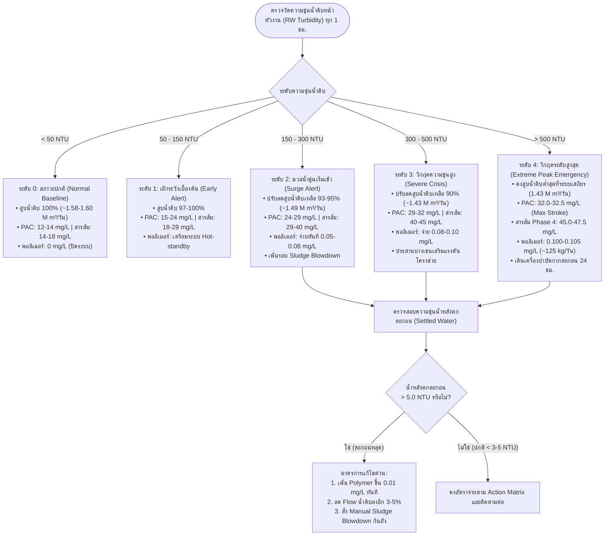

# แผนปฏิบัติการมาตรฐานและเมทริกซ์ขั้นบันไดการควบคุมสารเคมี (SOP & Action Matrix)
## การบริหารจัดการกระบวนการผลิตน้ำประปาในสภาวะน้ำดิบความขุ่นสูง (> 500 NTU)
**โรงงานผลิตน้ำมหาสวัสดิ์ (MS) การประปานครหลวง**
*เอกสารควบคุมการปฏิบัติงานฉุกเฉิน (Standard Operating Procedure: SOP-MS-TURB-01)*

---

## 1. วัตถุประสงค์และขอบเขต (Objective & Scope)
1. กำหนดขั้นตอนการปฏิบัติงานที่เป็นมาตรฐาน (Standard Operating Procedure) สำหรับวิศวกรเวร, เจ้าหน้าที่ห้องควบคุม (Control Room Operator), และพนักงานเดินระบบผลิตน้ำ ในการปรับอัตราการสูบน้ำดิบและการจ่ายสารเคมี (PAC, สารส้ม, พอลิเมอร์)
2. ป้องกันปัญหาตะกอนหลุดข้ามถังตกตะกอน (Sludge Carryover) และการอุดตันของถังกรองทราย (Rapid Filter Clogging) ในช่วงที่มวลน้ำขุ่นจากลุ่มน้ำแม่กลองตอนบน (แควน้อย-แควใหญ่) พุ่งสูงเกิน 500 NTU
3. ควบคุมคุณภาพน้ำประปาสูบจ่ายให้ได้ตามเกณฑ์มาตรฐานคุณภาพน้ำประปาดื่มได้ของการประปานครหลวง (Turbidity น้ำใสสูบจ่าย < 0.5 NTU) ตลอด 24 ชั่วโมง

---

## 2. ผังกระบวนการตัดสินใจ (Operational Decision Flowchart)



---

## 3. เมทริกซ์ขั้นบันไดการควบคุมการจ่ายสารเคมี (Action Matrix by Turbidity Tiers)

ตารางเทียบอัตราจ่ายสารเคมีและอัตราสูบน้ำดิบแยกตาม Phase (อ้างอิงสถิติการเดินระบบจริงปี 2024):

| ระดับความวิกฤต (Alert Tier) | ความขุ่นน้ำดิบ (NTU) | อัตราสูบน้ำดิบแนะนำ (m³/วัน) | Phase 1 & 2 (Pulsator)<br>PAC (mg/L) | Phase 3 (Superpulsator)<br>PAC (mg/L) | Phase 4 (Superpulsator)<br>สารส้ม (mg/L) | ทุก Phase<br>Polymer (mg/L) | ปริมาณ Polymer รวมรายวัน (kg/วัน) | รอบระบายตะกอน (Sludge Blowdown) |
|:---:|:---:|:---:|:---:|:---:|:---:|:---:|:---:|:---:|
| **Level 0 (ปกติ)** | < 50 | 1,580,000 – 1,600,000 | 12.0 – 14.5 | 9.5 – 12.0 | 14.0 – 18.0 | **0.000** (ปิด) | **0 kg** | อัตโนมัติ ปกติ (ทุก 30 นาที) |
| **Level 1 (เฝ้าระวัง)** | 50 – 150 | 1,530,000 – 1,560,000 | 15.0 – 24.0 | 12.0 – 20.0 | 18.0 – 29.0 | **0.020 – 0.050** | **30 – 75 kg** | อัตโนมัติ (ทุก 20 นาที) |
| **Level 2 (มวลน้ำเข้า)** | 150 – 300 | 1,480,000 – 1,500,000 | 24.0 – 29.0 | 20.0 – 27.0 | 29.0 – 40.0 | **0.055 – 0.080** | **80 – 115 kg** | เพิ่มความถี่ (ทุก 10–15 นาที) |
| **Level 3 (วิกฤต)** | 300 – 500 | 1,430,000 – 1,450,000 | 29.0 – 32.0 | 27.0 – 30.5 | 40.0 – 45.0 | **0.080 – 0.100** | **115 – 125 kg** | ทุก 5–10 นาที (เปิดระบาย 30 วิ) |
| **Level 4 (วิกฤตสูงสุด)** | > 500 | **1,430,000** *(Min Safe)* | **32.0 – 32.5** *(Max)* | **30.5 – 32.0** | **45.0 – 47.5** *(Max)* | **0.100 – 0.105** | **125 – 130 kg** | ระบายตะกอนต่อเนื่องสลับ Phase |

> [!IMPORTANT]
> **หมายเหตุเชิงเทคนิค:**
> * **Phase 1 & 2 (ถังตกตะกอนแบบ Pulsator):** มีความไวต่อความเร็วการไหลล้น (Overflow velocity) สูงกว่า Phase 3 & 4 จึงต้องปรับลด Flow เข้า Phase 1 & 2 ก่อน และจ่าย Polymer ในอัตราที่สูงกว่าเล็กน้อยเพื่อรักษาระดับ Sludge Blanket
> * **Phase 4 (ใช้สารส้มเป็นหลัก):** สารส้มทำให้เกิดตะกอนเบากว่า PAC ที่ความขุ่นสูง การจ่ายสารส้มระดับ 40–47 mg/L จะดึงค่าความเป็นกรด-ด่าง (pH) ของน้ำลดลง ต้องตรวจวัด pH น้ำหลังเติมสารส้มให้อยู่ในช่วง 6.5–7.2 เสมอ หาก pH ต่ำกว่า 6.3 อาจต้องพิจารณาเติมปูนขาว (Lime) เสริม

---

## 4. ขั้นตอนการเตรียมและการจ่ายสารพอลิเมอร์ (Polymer Batching & Dosing Protocol)

เนื่องจากปัจจุบันมี Polymer สำรองที่ยืมจากบางเขน **250 กิโลกรัม** การใช้งานต้องมีประสิทธิภาพสูงสุด ไม่ให้เกิดการสูญเสียจากการละลายไม่หมด:

```
[ขั้นตอนการเตรียมสารละลาย Polymer]
ถังผสมน้ำดี → โรยผงผ่านหัวฉีดกระจาย (Eductor) → กวนผสมความเข้มข้น 0.05% - 0.1% w/v → บ่ม (Aging) 45-60 นาที → ถังจ่าย Day Tank
```

1. **สัดส่วนการผสม (Concentration):**
   * กำหนดความเข้มข้นสารละลายที่ **0.05% ถึง 0.10% w/v** (ผงพอลิเมอร์ 5–10 กิโลกรัม ต่อน้ำสะอาด 10,000 ลิตร)
   * **ข้อห้ามเด็ดขาด:** ห้ามผสมเข้มข้นเกิน 0.2% เพราะสารละลายจะหนืดเกินไป ทำให้ปั๊มสูบจ่ายไม่สม่ำเสมอและเกิดการอุดตัน
2. **เวลาในการกวนบ่ม (Aging Time):**
   * ต้องเปิดใบพัดกวนช้าต่อเนื่องอย่างน้อย **45–60 นาที** ก่อนนำไปใช้งาน เพื่อให้สายโซ่พอลิเมอร์คลายตัวสมบูรณ์
   * ตรวจสอบว่าไม่มีก้อนเจลตกค้าง (Fish-eyes) เพราะแสดงว่าผงจับตัวเป็นก้อนและไม่ได้สร้างคุณสมบัติช่วยตกตะกอน
3. **จุดจ่ายสารเคมี (Injection Point):**
   * ฉีดจ่าย Polymer หลังจุดจ่าย Coagulant (PAC/สารส้ม) ประมาณ **30–60 วินาที** (บริเวณปลาย Rapid Mixing หรือทางเข้า Flocculation Basin) เพื่อให้ Coagulant ทำปฏิกิริยาสะเทินประจุ (Destabilization) ก่อนที่ Polymer จะเข้าทำหน้าที่จับสะพานเชื่อมอนุภาค (Interparticle Bridging)

---

## 5. การควบคุมการระบายตะกอนและระบบกรอง (Sludge Management & Filtration)

### 5.1 ระบบระบายตะกอน (Sludge Blowdown)
* **การตรวจวัด Sludge Blanket:** ให้โอเปอเรเตอร์ใช้ Sludge Judge หรือกระบอกตักวัดระดับชั้นตะกอนในถัง Pulsator ทุก 2 ชั่วโมง
* **เกณฑ์การสั่งระบาย:** หากระดับชั้นตะกอนสูงเกินระดับ **1.5 เมตรจากก้นบ่อ (หรือเข้าใกล้แผ่น Weirs ต่ำกว่า 1.0 เมตร)** ให้เปลี่ยนเป็นโหมด Manual Blowdown ทันที เพื่อป้องกัน Sludge Wave พัดข้าม Weirs เข้าสู่รางน้ำตกตะกอน
* **ระบบบำบัดตะกอน (Centrifuge / Filter Press):** เดินเครื่องรีดตะกอนต่อเนื่อง 24 ชั่วโมง โดยไม่ต้องรอรอบกะกลางวัน เพื่อระบาย Sludge ออกจากบ่อพักตะกอนให้มีพื้นที่รองรับน้ำขุ่นใหม่

### 5.2 การบริหารจัดการถังกรอง (Filter Bed Management)
* **เกณฑ์การล้างย้อน (Backwash Trigger):**
  * ปกติล้างตามเวลา (Run time 48–72 ชม.)
  * ในช่วงวิกฤต: ให้เปลี่ยนมาล้างตาม **สูญเสียแรงดัน (Headloss > 1.8 เมตร)** หรือ **ความขุ่นน้ำกรองแตะ 0.35 NTU** ทันที โดยไม่ต้องรอครบเวลา
* **การเตรียมน้ำล้างกรอง (Backwash Water Reserve):**
  * ตรวจสอบระดับน้ำในหอถังล้างกรอง (Wash Water Tank) ให้เต็มตลอดเวลา และบริหารรอบการล้างไม่ให้ซ้อนกันเกิน 2 บ่อในเวลาเดียวกัน เพื่อป้องกันแรงดันตกในระบบผลิต

---

## 6. เช็กลิสต์การปฏิบัติงานประจำกะ (Shift Operator Checklist)

### กะเช้า (08:00 – 16:00 น.)
- [ ] ตรวจรับรายงานสถานการณ์น้ำดิบต้นน้ำ (แควใหญ่-แควน้อย) และคำนวณ Lead time
- [ ] ทำ Jar Test เพื่อสอบเทียบ Optimum Dose ของ PAC, Alum, และ Polymer อย่างน้อย 2 ครั้ง/วัน
- [ ] เช็กยอดสต็อก Polymer คงคลัง (kg) เปรียบเทียบกับแบบจำลอง Stock Burn-down
- [ ] ตรวจเช็กระบบเตรียมสารเคมี ถังผสม ใบกวน และปั๊มสารเคมีสำรอง (Standby Pumps)
- [ ] รายงานยอดสูบจ่ายและยอดใช้สารเคมีต่อหัวหน้ากองผลิตและผู้อำนวยการโรงงาน

### กะบ่าย (16:00 – 24:00 น.)
- [ ] ตรวจวัดระดับ Sludge Blanket ในถังตกตะกอนทุก Phase เวลา 17:00 และ 21:00 น.
- [ ] ตรวจเช็กสารละลาย Polymer ใน Day Tanks ให้มีสำรองเพียงพอสำหรับการจ่ายตลอดคืน
- [ ] ตรวจเช็กความดันสูญเสีย (Headloss) และความขุ่นของน้ำกรองทุกบ่อ
- [ ] ประสานงานศูนย์ควบคุมการจ่ายน้ำเพื่อยืนยันระดับน้ำในถังน้ำใส (Clear Water Basins)

### กะดึก (00:00 – 08:00 น.)
- [ ] เฝ้าระวังค่าความขุ่นน้ำดิบหน้าตะแกรงดักขยะทุก 1 ชั่วโมง (เนื่องจากมักมีการเปลี่ยนแปลงเฉียบพลันช่วงดึก)
- [ ] ตรวจวัดความขุ่นน้ำหลังตกตะกอน (Settled Water) ทุก Phase ทุก 2 ชั่วโมง
- [ ] ตรวจสอบการทำงานของวาล์วระบายตะกอนอัตโนมัติ (Pneumatic Sludge Valves) ไม่ให้เกิดการค้างหรือรั่วไหล
- [ ] ส่งมอบรายงานบันทึกการใช้สารเคมีและระดับสต็อกคงคลังแก่กะเช้า

---

## 7. สายการรายงานและการติดต่อสื่อสารฉุกเฉิน (Emergency Communication Tree)

```
[ตรวจพบความขุ่นน้ำดิบพุ่งสูง > 200 NTU หรือน้ำหลังตกตะกอน > 5.0 NTU]
                             │
                             ▼
              [วิศวกรเวรประจำโรงงานมหาสวัสดิ์]
                             │
            ┌────────────────┴────────────────┐
            ▼                                 ▼
   [ปรับระบบตาม SOP ทันที]          [แจ้ง ผู้อำนวยการกองผลิต / ผอ.ฝ่าย]
   - ปรับ Dosing Pump                - รายงานสถิติและอัตราใช้สารเคมี
   - ปรับลด Flow สูบน้ำดิบ            - ยืนยันสต็อก Polymer คงเหลือ
            │                                 │
            ▼                                 ▼
   [ประสานศูนย์ควบคุมการจ่ายน้ำ]    [ประสานโรงงานบางเขน / จัดซื้อ]
   - แจ้งลดจ่ายน้ำประปา ~150,000 m³   - จองคิวรถบรรทุกยืม Polymer เพิ่ม
   - ให้บางเขนเตรียมเพิ่มแรงดันชดเชย  - ประสาน Supplier เร่งส่ง PAC
```

* **ผู้ประสานงานหลัก:** วิศวกรเวรโรงงานผลิตน้ำมหาสวัสดิ์ (โทรสายตรงห้องควบคุม / วิทยุสื่อสารช่องปฏิบัติการผลิต)
* **ศูนย์ควบคุมการส่งจ่ายน้ำประปานครหลวง:** แจ้งปรับสมดุลแรงดันล่วงหน้าอย่างน้อย 2–3 ชั่วโมงก่อนลดอัตราสูบจ่าย
